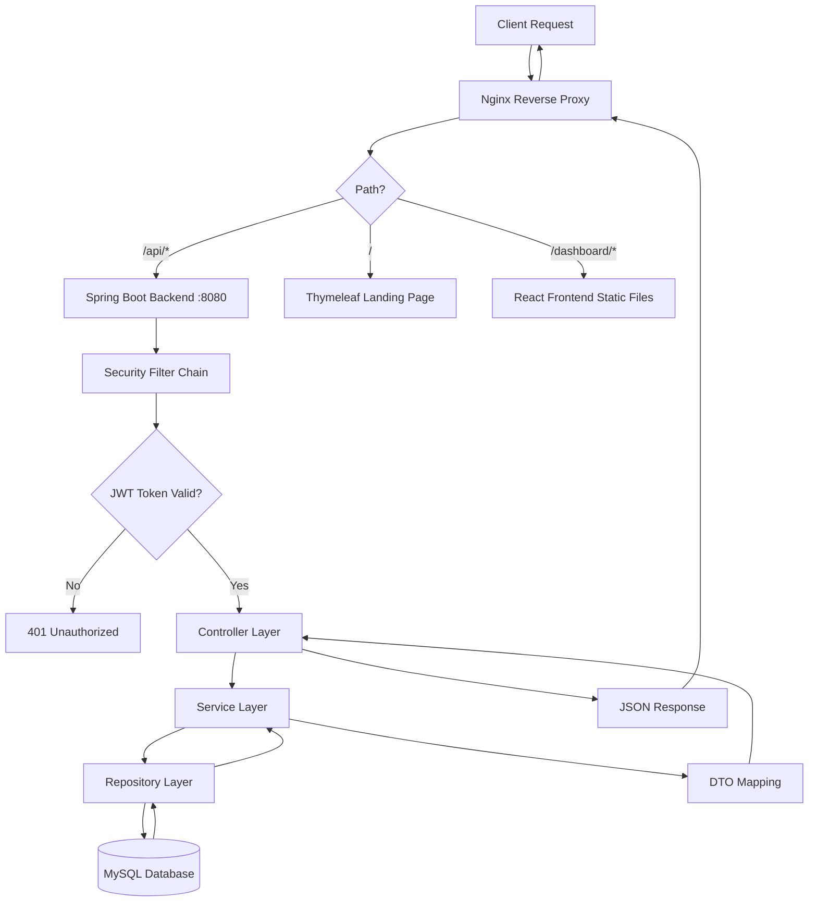
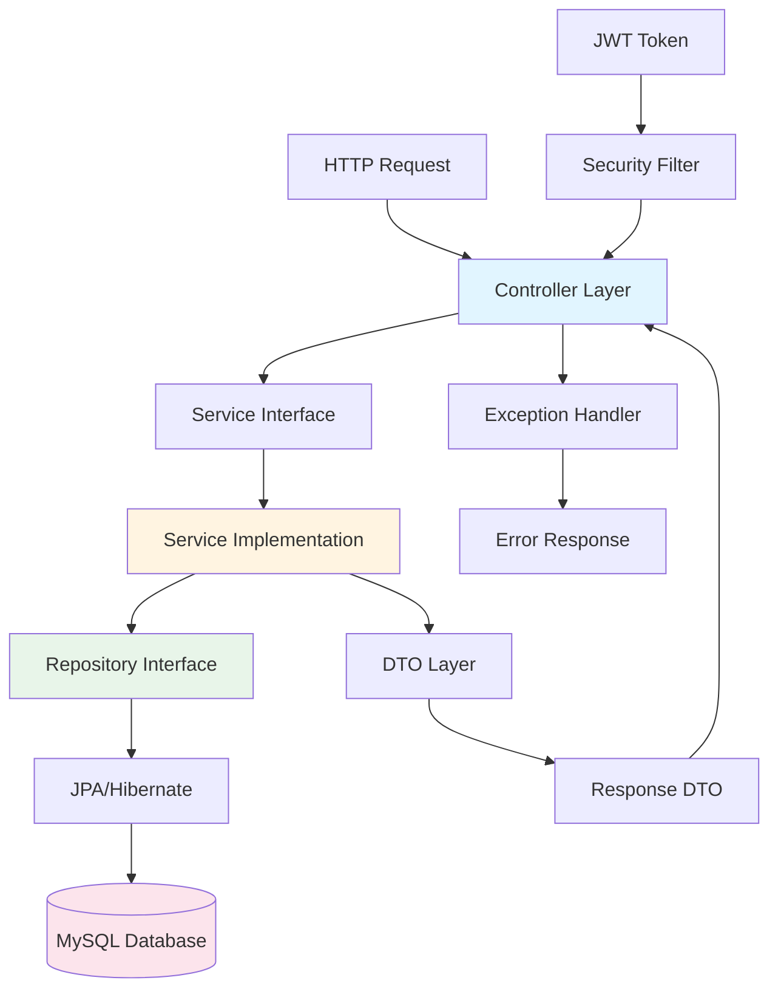
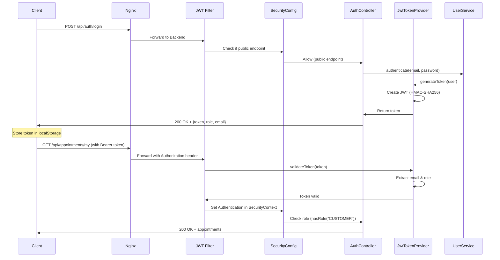
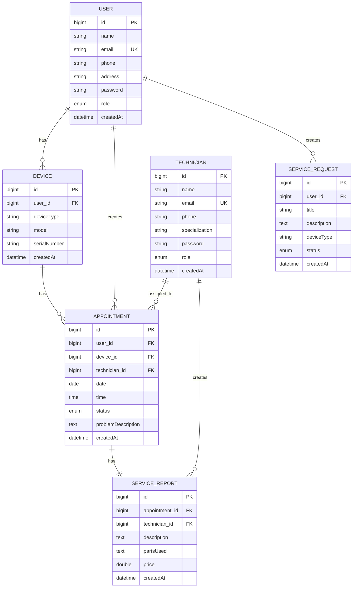
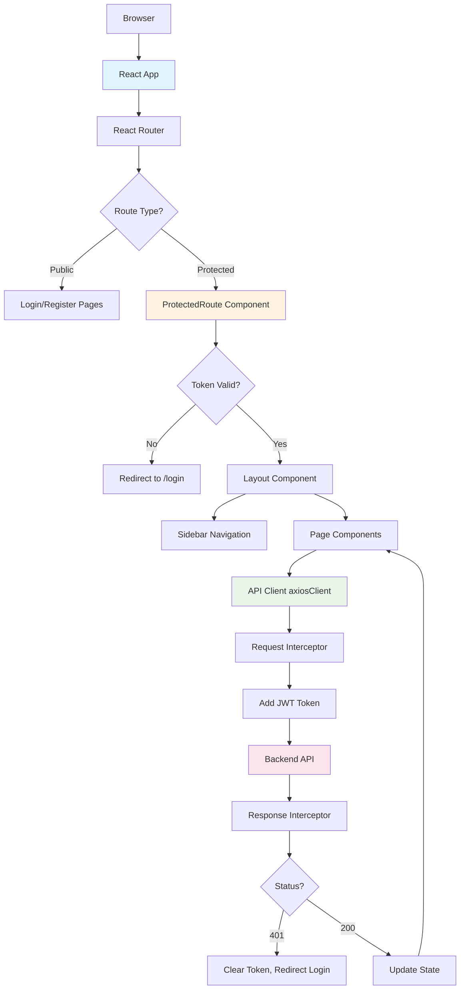
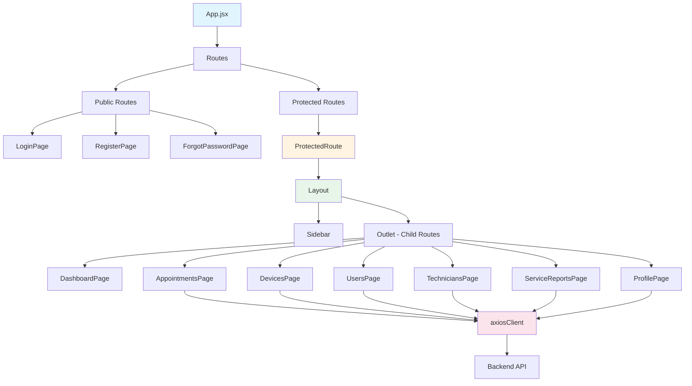
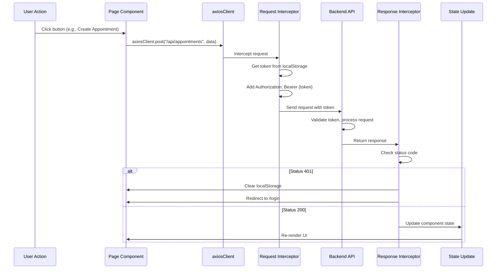
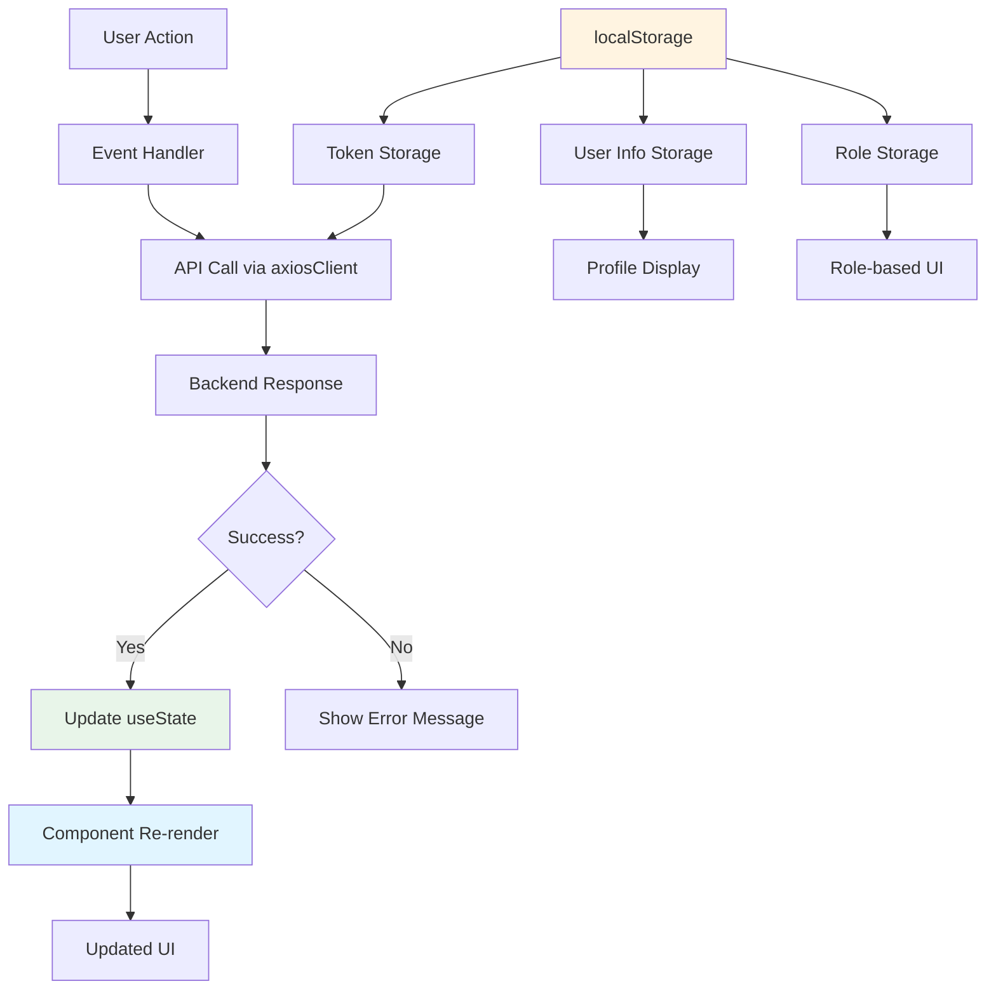
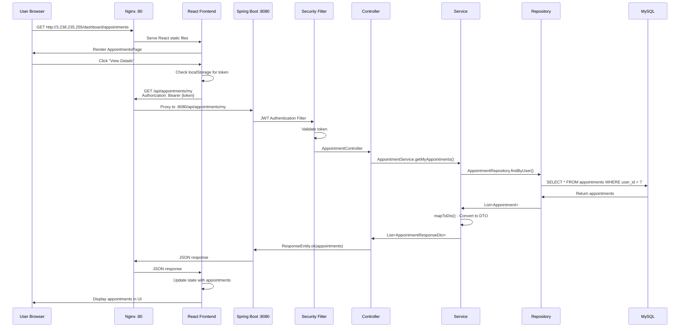

# 🏗️ BAYMAK SERVICE MANAGEMENT SYSTEM - MİMARİ DİYAGRAMLARI

## 📊 BACKEND MİMARİSİ

### 1. Genel Mimari Akış (Request Flow)



### 2. Backend Layer Mimarisi



### 3. Backend Package Yapısı

```
com.baymak.backend
│
├── config/
│   ├── SecurityConfig.java          # Spring Security, CORS, PasswordEncoder
│   └── OpenApiConfig.java           # Swagger/OpenAPI configuration
│
├── controller/                      # REST API Endpoints
│   ├── AuthController.java          # /api/auth/**
│   ├── AppointmentController.java  # /api/appointments/**
│   ├── UserController.java         # /api/users/**
│   ├── TechnicianController.java   # /api/technicians/**
│   ├── DeviceController.java       # /api/devices/**
│   ├── ServiceReportController.java # /api/service-reports/**
│   ├── ServiceRequestController.java # /api/requests/**
│   └── PageController.java         # / (Thymeleaf)
│
├── service/                         # Business Logic Interface
│   ├── AuthService.java
│   ├── AppointmentService.java
│   ├── UserService.java
│   └── ...
│
├── service/impl/                    # Business Logic Implementation
│   ├── AuthServiceImpl.java
│   ├── AppointmentServiceImpl.java
│   ├── UserServiceImpl.java
│   └── ...
│
├── repository/                      # Data Access Layer
│   ├── UserRepository.java          # extends JpaRepository<User, Long>
│   ├── AppointmentRepository.java
│   ├── DeviceRepository.java
│   └── ...
│
├── model/                           # JPA Entities
│   ├── User.java
│   ├── Technician.java
│   ├── Device.java
│   ├── Appointment.java
│   ├── ServiceReport.java
│   └── ServiceRequest.java
│
├── dto/                             # Data Transfer Objects
│   ├── Request DTOs:
│   │   ├── AppointmentRequestDto.java
│   │   ├── UserRequestDto.java
│   │   └── ...
│   └── Response DTOs:
│       ├── AppointmentResponseDto.java
│       ├── UserResponseDto.java
│       └── ...
│
├── security/                        # Security Components
│   ├── JwtTokenProvider.java        # Token generation & validation
│   ├── JwtAuthenticationFilter.java # JWT filter
│   └── CustomUserDetailsService.java # UserDetailsService
│
└── exception/                       # Exception Handling
    ├── GlobalExceptionHandler.java
    ├── NotFoundException.java
    ├── BadRequestException.java
    └── ...
```

### 4. Security Flow (Authentication & Authorization)



### 5. Database Entity Relationships



---

## 🎨 FRONTEND MİMARİSİ

### 1. Frontend Genel Mimari



### 2. Frontend Component Hierarchy



### 3. Frontend Folder Structure

```
src/
│
├── main.jsx                        # React entry point
├── App.jsx                         # Main routing component
├── App.css
│
├── api/
│   └── axiosClient.js             # Axios configuration, interceptors
│
├── components/
│   ├── Layout.jsx                  # Main layout with sidebar
│   └── ProtectedRoute.jsx         # Route protection component
│
├── pages/
│   ├── LoginPage.jsx               # Authentication
│   ├── RegisterPage.jsx           # User registration
│   ├── ForgotPasswordPage.jsx      # Password reset
│   ├── DashboardPage.jsx           # Role-based dashboard
│   ├── AppointmentsPage.jsx        # Appointment management
│   ├── DevicesPage.jsx            # Device CRUD (Customer)
│   ├── UsersPage.jsx              # User management (Admin)
│   ├── TechniciansPage.jsx        # Technician management (Admin)
│   ├── ServiceReportsPage.jsx     # Service reports (Tech/Admin)
│   └── ProfilePage.jsx            # User profile
│
└── assets/
    └── react.svg
```

### 4. React Router Yapısı

```mermaid
graph LR
    A[/] --> B[Thymeleaf Landing Page<br/>Backend'den serve]
    
    C[/login] --> D[LoginPage]
    E[/register] --> F[RegisterPage]
    G[/forgot-password] --> H[ForgotPasswordPage]
    
    I[/dashboard] --> J[ProtectedRoute]
    J --> K[Layout]
    
    K --> L[/dashboard<br/>DashboardPage]
    K --> M[/dashboard/appointments<br/>AppointmentsPage]
    K --> N[/dashboard/devices<br/>DevicesPage]
    K --> O[/dashboard/users<br/>UsersPage]
    K --> P[/dashboard/technicians<br/>TechniciansPage]
    K --> Q[/dashboard/reports<br/>ServiceReportsPage]
    K --> R[/dashboard/profile<br/>ProfilePage]
    
    style B fill:#e1f5ff
    style J fill:#fff4e1
    style K fill:#e8f5e9
```

### 5. API Client Flow (Request/Response)



### 6. State Management Flow



---

## 🔄 FULL STACK FLOW (End-to-End)

### Complete Request Flow



---

## 📋 MİMARİ ÖZET TABLOSU

### Backend Layers

| Layer | Responsibility | Example Files |
|-------|---------------|---------------|
| **Controller** | HTTP request handling, routing | `AppointmentController.java` |
| **Service** | Business logic, validation | `AppointmentServiceImpl.java` |
| **Repository** | Data access, database queries | `AppointmentRepository.java` |
| **Model** | Entity classes, database schema | `Appointment.java` |
| **DTO** | Data transfer, API contracts | `AppointmentResponseDto.java` |
| **Security** | Authentication, authorization | `SecurityConfig.java`, `JwtTokenProvider.java` |
| **Exception** | Error handling | `GlobalExceptionHandler.java` |

### Frontend Layers

| Layer | Responsibility | Example Files |
|-------|---------------|---------------|
| **Pages** | Page components, UI | `AppointmentsPage.jsx` |
| **Components** | Reusable UI components | `Layout.jsx`, `ProtectedRoute.jsx` |
| **API Client** | HTTP requests, interceptors | `axiosClient.js` |
| **Router** | Client-side routing | `App.jsx` |
| **State** | Component state, localStorage | `useState`, `localStorage` |

### Deployment Architecture

```
Internet
    ↓
AWS EC2 Instance (3.238.235.255)
    ↓
Nginx (Port 80)
    ├── / → Spring Boot :8080 (Thymeleaf)
    ├── /api/* → Spring Boot :8080 (REST API)
    └── /dashboard/* → React Static Files (/var/www/html)
    ↓
Spring Boot Application (:8080)
    ├── Controllers
    ├── Services
    ├── Repositories
    └── Security
    ↓
MySQL Database (:3306)
    └── baymak database
```

---

## 🎯 ÖNEMLİ NOTLAR

### Backend:
- **Layered Architecture**: Controller → Service → Repository → Database
- **Separation of Concerns**: Her layer kendi sorumluluğuna odaklanır
- **Security First**: Tüm endpoint'ler SecurityConfig ile korunur
- **DTO Pattern**: Entity'ler direkt expose edilmez

### Frontend:
- **Component-Based**: Her sayfa bir component
- **Protected Routes**: Token kontrolü ile route koruması
- **API Abstraction**: axiosClient ile merkezi API yönetimi
- **State Management**: Local state (useState) + localStorage

### Deployment:
- **Nginx Reverse Proxy**: Traffic routing
- **Static Files**: React build output
- **Systemd Service**: Backend otomatik başlatma
- **All-in-One**: Backend + Frontend + Database aynı instance'da

---

**Bu diyagramları sunumda kullanabilirsiniz!** 📊

